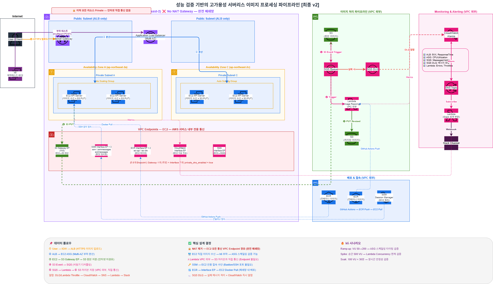

# aws-cloud-pipeline-project
부하분산테스트 

## 시스템 아키텍처


## `deploy.sh` 사용 가이드

복잡한 배포 과정을 자동화하기 위해 루트 디렉토리에 `deploy.sh` 스크립트 제공

1. **Infrastructure (Storage)**: ECR 리포지토리를 우선 생성
2. **Docker Build & Push**: API 서버(EC2)와 이미지 처리기(Lambda) 이미지를 빌드 후 ECR에 업로드
3. **Full Infrastructure**: 나머지 모든 네트워크 및 컴퓨팅 리소스를 배포

### 사전 준비 사항
- **Docker Desktop**: 로컬에 도커 실행 중
- **AWS CLI**: `aws configure` 사용 권한 설정
- **Terraform**: v1.0.0 이상 버전 설치

### 실행 방법
프로젝트 루트 폴더에서 다음 명령어를 입력합니다

```bash
chmod +x deploy.sh # 1. 스크립트 실행 권한 부여 (최초 1회)
./deploy.sh # 2. 통합 배포 실행